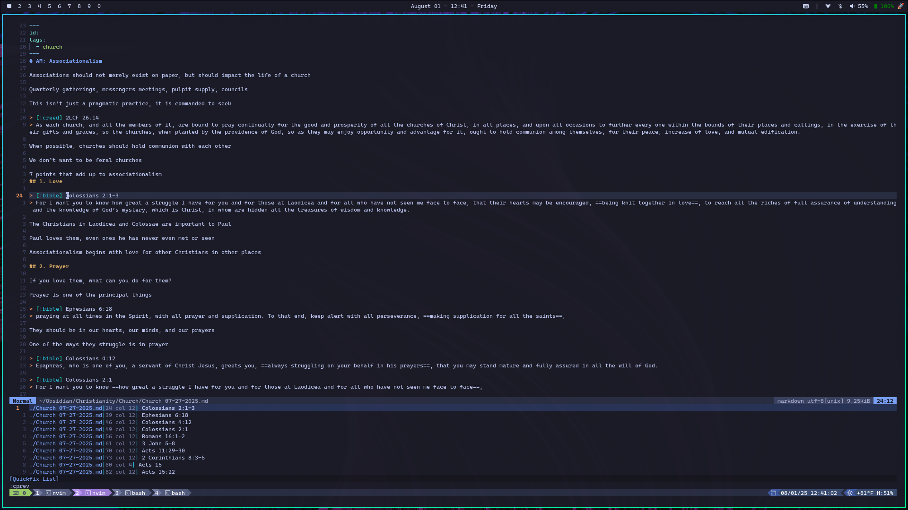
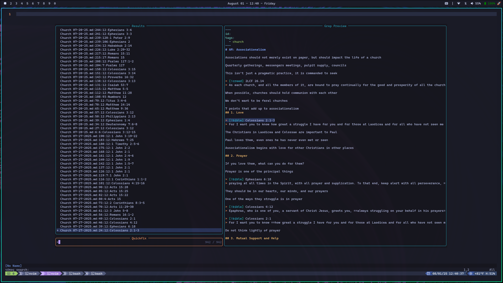

# τόπος

> [τόπος](https://biblehub.com/greek/5117.htm): spot, location, position

Locate Bible verses in text, files, and entire directories!

Check out the [CLI Tool](./crates/topos-cli/README.md)!

## Showcase

### Neovim

The search results can be integrated into the Neovim QuickSwitcher and Telescope!





<details>
<summary>See Lua Code</summary>

I am not a Lua expert, but this is just a make-shift integration that works for now.
It just runs `topos` as a subprocess and parses the output.

```lua
-- Searches all files in directory
function search_bible_verses()
  local args = ''
  local status, err = pcall(function()
    args = vim.fn.input 'τόπος search: '
  end)

  if not status then
    return
  end

  -- Escape args for shell safety
  if args ~= '' then
    args = vim.fn.shellescape(args)
  end

  local output = vim.fn.systemlist('topos . ' .. args .. ' -m quickfix')

  -- Check if the command succeeded
  if vim.v.shell_error ~= 0 then
    vim.notify('Error running topos: ' .. table.concat(output, '\n'), vim.log.levels.ERROR)
    return
  end

  -- Parse and fill quickfix list
  local qf_list = {}
  for _, line in ipairs(output) do
    local file, lnum, col, text = line:match '([^:]+):(%d+):(%d+):%s?(.*)'
    if file and lnum and col and text then
      table.insert(qf_list, {
        filename = file,
        lnum = tonumber(lnum),
        col = tonumber(col),
        text = text,
      })
    end
  end

  if #qf_list == 0 then
    print 'No matches found.'
    return
  end

  -- Populate quickfix list
  vim.fn.setqflist({}, ' ', { title = 'τόπος Results', items = qf_list })
  -- Open Telescope quickfix preview
  require('telescope.builtin').quickfix()
end

vim.api.nvim_create_user_command('SearchVersesInDirectory', search_bible_verses, {})

vim.api.nvim_set_keymap(
  'n',
  '<leader>svd',
  ':lua search_bible_verses()<CR>',
  { noremap = true, silent = true, desc = '[S]earch Bible [V]erses in [D]irectory' }
)

-- Searches only in current file
function search_local_bible_verses()
  local args = ''
  local status, err = pcall(function()
    args = vim.fn.input 'τόπος search: '
  end)
  if not status then
    return
  end

  -- Escape args for shell safety
  if args ~= '' then
    args = vim.fn.shellescape(args)
  end

  -- Get current buffer content
  local buffer_lines = vim.api.nvim_buf_get_lines(0, 0, -1, false)

  local output = vim.fn.systemlist('topos ' .. args .. ' -m quickfix ', buffer_lines)

  -- Check if the command succeeded
  if vim.v.shell_error ~= 0 then
    vim.notify('Error running topos: ' .. table.concat(output, '\n'), vim.log.levels.ERROR)
    return
  end

  local qf_list = {}
  local buf_name = vim.api.nvim_buf_get_name(0) -- Use current buffer name

  for _, line in ipairs(output) do
    -- Adjust pattern based on actual output format
    -- Example: "3:10:καὶ ἐν ἀρχῇ..."
    local lnum, col, text = line:match '^:(%d+):(%d+):%s?(.*)'
    if lnum and col and text then
      table.insert(qf_list, {
        filename = buf_name,
        lnum = tonumber(lnum),
        col = tonumber(col),
        text = text,
      })
    end
  end

  if #qf_list == 0 then
    print 'No matches found.'
    return
  end

  -- Populate quickfix list
  vim.fn.setqflist({}, ' ', { title = 'τόπος Results', items = qf_list })
  -- Open Telescope quickfix preview
  require('telescope.builtin').quickfix()
end

vim.api.nvim_create_user_command('SearchVersesInFile', search_local_bible_verses, {})

vim.api.nvim_set_keymap(
  'n',
  '<leader>svf',
  ':lua search_local_bible_verses()<CR>',
  { noremap = true, silent = true, desc = '[S]earch Bible [V]erses in [F]ile' }
)
```

</details>
